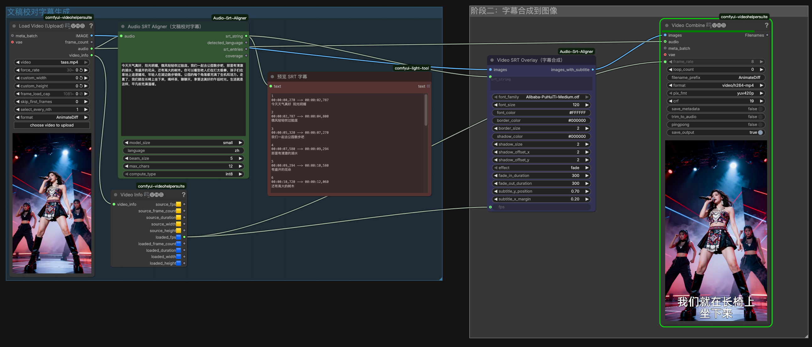

# ComfyUI-Audio-Srt-Aligner

基于 faster-whisper 的词级时间戳，将音频与参考文本对齐，自动生成精确时间戳的 SRT 字幕，并可将字幕渲染合成到视频画面上。

## 功能特性

- **AudioSrtAligner (文稿校对字幕)** — 将参考文本/台词文稿与音频对齐，生成 SRT 字幕。支持中英文等多种语言，自动检测语言，支持字幕最大字数限制与智能分词切分。
- **VideoSrtOverlay (字幕合成)** — 将 SRT 字幕渲染合成到视频画面上。支持中文字体下拉选择、自动折行、描边阴影、淡入淡出等效果。

## 安装

1. 将本插件克隆到 ComfyUI 的 `custom_nodes` 目录：

```bash
cd ComfyUI/custom_nodes
git clone git@github.com:ahkimkoo/ComfyUI-Audio-Srt-Aligner.git
```

2. 安装依赖：

```bash
cd ComfyUI/custom_nodes/ComfyUI-Audio-Srt-Aligner
pip install -r requirements.txt
```

3. 重启 ComfyUI，节点将自动注册。

## 典型工作流



📥 [下载工作流文件 (Audio-srt-aligner--srt-overlay.json)](example/Audio-srt-aligner--srt-overlay.json)

```
LoadAudio → AudioSrtAligner → VideoSrtOverlay → Preview/Save
              ↑                    ↑
         reference_text       images (视频帧)
```

## 节点 1：AudioSrtAligner (文稿校对字幕)

将参考文本与音频对齐，生成带精确时间戳的 SRT 字幕。

### 输入参数

| 参数 | 类型 | 必填 | 默认值 | 说明 |
|------|------|------|--------|------|
| `audio` | AUDIO | 是 | — | 音频输入（来自 LoadAudio 等节点） |
| `reference_text` | STRING | 是 | — | 参考文本/台词文稿 |
| `model_size` | COMBO | 是 | `small` | Whisper 模型：tiny, base, small, medium, large-v3 |
| `language` | STRING | 是 | `zh` | 语言代码（zh, en, ja 等），留空自动检测 |
| `beam_size` | INT | 否 | 5 | Beam search 大小（1-10） |
| `max_chars` | INT | 否 | 12 | 每行字幕最大字数限制（1-100），超出时按中文分词边界自动切分 |
| `compute_type` | COMBO | 否 | `int8` | 计算精度：int8, int8_float16, float16, float32 |

### 输出

| 输出 | 类型 | 说明 |
|------|------|------|
| `srt_string` | STRING | 生成的 SRT 字幕内容 |
| `detected_language` | STRING | 检测到的语言代码 |
| `srt_entries` | INT | SRT 条目数量 |
| `coverage` | FLOAT | 对齐覆盖率百分比 |

### max_chars 分句说明

当单句字幕超过 `max_chars` 时，插件会使用 jieba 中文分词找到合适的词语边界进行切分，保证：
- 每行不超过 `max_chars` 字数
- 切分点始终在词语边界（不会把"太极拳"拆成"太极"+"拳"）
- 时间戳按字符比例自动插值

## 节点 2：VideoSrtOverlay (字幕合成)

将 SRT 字幕渲染合成到视频画面上。严格按 SRT 原文逐条渲染，不合并不拆分。

### 输入参数

| 参数 | 类型 | 必填 | 默认值 | 说明 |
|------|------|------|--------|------|
| `images` | IMAGE | 是 | — | 视频帧批次 (B, H, W, C) |
| `srt_string` | STRING | 是 | — | SRT 字幕内容 |
| `font_family` | COMBO | 是 | — | 字体下拉选择，自动聚合 `fonts/` 和 `models/fonts/` 下的字体 |
| `font_size` | INT | 否 | `120` | 字体大小（12-200） |
| `font_color` | STRING | 否 | `#FFFFFF` | 字体颜色（十六进制） |
| `border_color` | STRING | 否 | `#000000` | 描边颜色 |
| `border_size` | INT | 否 | 2 | 描边宽度（0-20） |
| `shadow_color` | STRING | 否 | `#000000` | 阴影颜色 |
| `shadow_size` | INT | 否 | `2` | 阴影模糊半径（0-20） |
| `shadow_offset_x` | INT | 否 | 2 | 阴影 X 偏移（-20~20） |
| `shadow_offset_y` | INT | 否 | 2 | 阴影 Y 偏移（-20~20） |
| `effect` | COMBO | 否 | `fade` | 特效：fade（淡入淡出）、none |
| `fade_in_duration` | INT | 否 | 300 | 淡入时长（ms，0-2000） |
| `fade_out_duration` | INT | 否 | 300 | 淡出时长（ms，0-2000） |
| `subtitle_y_position` | FLOAT | 否 | `0.70` | 字幕垂直位置（0.0=顶部，1.0=底部） |
| `subtitle_x_margin` | FLOAT | 否 | `0.20` | 水平总留白比例（0.0~0.5），控制长文字自动折行宽度 |
| `fps` | FLOAT | 否 | 24.0 | 视频帧率 |

### 输出

| 输出 | 类型 | 说明 |
|------|------|------|
| `images_with_subtitle` | IMAGE | 合成字幕后的视频帧 |

### 字体说明

- 插件自带阿里巴巴普惠体 Medium（免费商用），首次加载自动下载到 `fonts/` 目录。
- 也可手动将 `.ttf/.otf/.ttc` 字体文件放入 `fonts/` 或 ComfyUI 的 `models/fonts/` 目录，节点会自动识别并在下拉菜单中列出。

### 自动折行

当字幕文字宽度超过可用区域（由 `subtitle_x_margin` 控制）时，自动折行为多行，每行水平居中。

## 依赖

- `faster-whisper>=1.1.0` — Whisper 语音识别引擎
- `numpy` — 数值计算
- `Pillow>=10.0.0` — 图像处理与字幕渲染
- `av>=10.0.0` — 音频解码
- `jieba` — 中文分词（用于字幕智能切分）

## 注意事项

### Whisper 模型

- 首次运行时会自动下载指定的 Whisper 模型。
- 模型保存到 `ComfyUI/models/stt/whisper/` 目录。
- 中国大陆用户如果下载缓慢，插件会自动使用 `hf-mirror.com` 镜像。
- Apple Silicon (M1/M2/M3) 上 `float16` 计算类型可能不可用，建议使用 `int8`。

### 字体

- 插件内置阿里巴巴普惠体 Medium（免费商用），适合视频字幕。
- 字体下拉菜单会自动聚合两个目录的字体文件：
  - `ComfyUI-Audio-Srt-Aligner/fonts/`（插件自带）
  - `ComfyUI/models/fonts/`（用户自定义）

### 中文支持

- 中文文本建议明确指定 `language` 为 `zh`，避免自动检测偏差。
- 插件会自动去除中文标点以获得更清爽的字幕显示。
